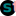

# My personal Quarto website 

A multilingual website (English / Greek) built with [Quarto](https://quarto.org/) and [babelquarto](https://docs.ropensci.org/babelquarto/).
Deployed using [GitHub Pages](https://pages.github.com/).

🔗 [Website Link](https://stesiam.com)

## Features

- 🌖 Light / Dark mode
- 🖌️️ Use Bootstrap library for styling
- 🔍 Add 404 page
- 📎 Remove .html endings on several links using folders containing quarto files named as index.qmd
- 🖊 Use Google fonts (Gentium Book) locally instead of using Google Fonts API (Alegreya)
- 🌐 Multilinguality (🇬🇧 / 🇬🇷)
- 🪄 Custom highlight style ([a11y-light](https://github.com/quarto-dev/quarto-cli/blob/main/src/resources/pandoc/highlight-styles/a11y-light.theme) / [a11y-dark](https://github.com/quarto-dev/quarto-cli/blob/main/src/resources/pandoc/highlight-styles/a11y-dark.theme))

## TO DOs

- giscus dark theme not rendering sometimes  ([Related Issue #8613](https://github.com/quarto-dev/quarto-cli/issues/8613))
- Visualizations filtering or change based on dark / light theme ([Possible Solution](https://mickael.canouil.fr/posts/2023-05-30-quarto-light-dark/))
