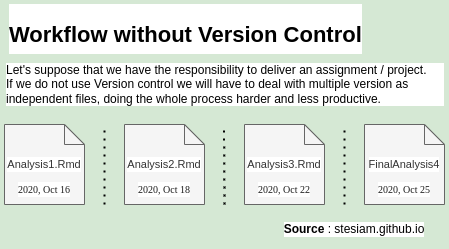
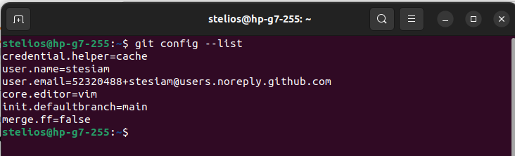

## Introduction

### What is a Version Control System?

A Version Control System (VCS) is a tool for managing and tracking changes to our code. As we develop an application, we add features and fix bugs, continuously modifying our codebase. A VCS allows us to save "snapshots" at various stages of development, so we can always see what changed, when, and by whom.



The most well-known version control systems for source code are:

- Git
- Apache Subversion (SVN)
- Mercurial
- Bazaar


### VCS Popularity

Having described what a VCS is, it is worth examining which of these has dominated over time. To answer this, we turn to historical search data from [Google Trends](https://trends.google.com/trends/), which tracks interest trends for popular terms.

```{r}
#| label: import_r_libs
#| warning: false
#| message: false
#| echo: false

library(readr)
library(dplyr)
library(lubridate)
library(highcharter)
```

```{r}
#| label: further_settings
#| include: false

options(digits = 4)
knitr::write_bib(.packages(), file = 'packages.bib')
```

```{r}
#| label: import_data
#| echo: false
#| message: false
#| warning: false

trends_vcs <- read_csv("multiTimeline.csv", skip = 2) %>%
  mutate(Date = lubridate::ym(Month)) %>%
  mutate(Year = lubridate::year(Date)) %>%
  select(-c(Month, Date))

trends_vcs_tidy <- tidyr::pivot_longer(
    trends_vcs,
    !Year,
    names_to  = "VCS",
    values_to = "counts"
  ) %>%
  group_by(Year, VCS) %>%
  summarize(AVG = sum(counts) / n(), .groups = "drop") %>%
  mutate(AVG = round(AVG, digits = 1))
```

```{r}
#| label: fig-vcs-trends
#| fig-cap: "Time series comparing search trends across version control systems (VCS)"
#| echo: false

avgPercentageGit <- trends_vcs_tidy %>%
  dplyr::filter(VCS == "git: (Worldwide)") %>%
  pull(AVG)

avgPercentageSVN <- trends_vcs_tidy %>%
  dplyr::filter(VCS == "svn: (Worldwide)") %>%
  pull(AVG)

highchart() %>%
  hc_title(text = "Trends in Version Control Systems (VCS)") %>%
  hc_subtitle(
    text    = "<span style='text-align:center;'>Comparing trends between <b>Git</b> and <b>SVN</b> (Subversion) from 2004 to 2022</span>",
    useHTML = TRUE
  ) %>%
  hc_caption(
    useHTML = TRUE,
    text    = '<b>Source:</b> <a href="https://trends.google.com/trends/" target="_blank">Google Trends</a>'
  ) %>%
  hc_plotOptions(series = list(marker = list(enabled = FALSE))) %>%
  hc_annotations(list(
    labels = list(
      list(
        point          = list(x = 12, y = 70, xAxis = 0, yAxis = 0),
        text           = "Git",
        rotation       = -30,
        backgroundColor = "rgba(255,255,255,0.7)",
        borderColor    = "black",
        style          = list(fontSize = "12px")
      ),
      list(
        point          = list(x = 12, y = 10, xAxis = 0, yAxis = 0),
        text           = "Subversion (SVN)",
        rotation       = 0,
        backgroundColor = "rgba(255,255,255,0.7)",
        borderColor    = "black",
        style          = list(fontSize = "12px")
      )
    )
  )) %>%
  hc_xAxis(categories = unique(trends_vcs_tidy$Year)) %>%
  hc_yAxis(title = list(text = "Search interest"), max = 90) %>%
  hc_add_series(name = "Git", data = avgPercentageGit, type = "line", color = "orange") %>%
  hc_add_series(name = "SVN",  data = avgPercentageSVN,  type = "line", color = "steelblue") %>%
  hc_tooltip(shared = TRUE)
```

The chart @fig-vcs-trends establishes Git as the dominant version control tool. Subversion (SVN) was more popular up until 2010, after which it entered a steady decline from which it never recovered. Today, Git is the *de facto* standard for source code management, and around it has grown a broad ecosystem of hosting platforms such as **GitHub** and **GitLab**.


### Advantages

> Why should I use such a tool?

- **Easy rollback:** If a change introduces a problem, we can revert to a previous, working version of the code with a single command.
- **Time savings:** Instead of manually hunting down what broke, Git tells us exactly what changed and when.
- **Collaboration:** It greatly simplifies working alongside other developers, especially through platforms like GitHub.


### Disadvantages

> Fair enough — but is there another side to this?

- **One more tool to manage:** Git adds a step to our workflow, making it slightly more complex at first.
- **Learning curve:** Getting comfortable with advanced features (branching, merging, rebasing) takes time. The basics, however, are quick to pick up.


### Code Hosting

The tools we have described manage code locally, on our own machine. If we want to share our work or collaborate with others, we need a remote hosting service. The most widely used options are **GitHub**, **GitLab**, and **Bitbucket**.

If none of these suits us, we can host our code ourselves. Tools such as [Gitea](https://gitea.io/en-us/) or its active fork, [Forgejo](https://forgejo.org/), allow us to set up our own platform on a private server — essentially our own GitHub, free from third-party dependencies. Appealing as it sounds, self-hosting comes with significant operational complexity and distances us from the broader developer community.


## Git Configuration

We have decided to try Git on a small project, or simply want to keep a version history of our work. Let us look at how to set it up properly from the start.

### Setting a Name and Email

The first time we use Git, it will ask us to provide a name and an email address. Without these, it will not allow us to record any changes. This is because every snapshot we create is accompanied by the details of whoever made it.

::: {.column-margin}


**Source:** By LFAsia via Wikimedia Commons, 2018 — License: [CC BY 3.0](https://creativecommons.org/licenses/by/3.0/). View the [original photo](https://commons.wikimedia.org/wiki/File:Lc3_2018_(263682303).jpeg).
:::

```{.bash filename="Terminal"}
git config --global user.name "YourName"
git config --global user.email your_email
```

:::{.callout-note}
If we plan to host our code on GitHub, it is worth hiding our personal email address. GitHub provides a *noreply* address for this purpose, so our real address is never exposed publicly. You can read more in the [GitHub documentation](https://docs.github.com/en/account-and-profile/setting-up-and-managing-your-personal-account-on-github/managing-email-preferences/setting-your-commit-email-address).
:::


### Text Editor

Before we talk about the editor, it is worth explaining what a **commit** is.
Every time we want to "save" the current state of our code, we create a commit.
In essence, we are creating a snapshot that records exactly which files changed
and how. Every commit must include a short message describing what we changed
and why, so we can later understand the history of our project at a glance.

To write that message, Git automatically opens a text editor. On many systems
(e.g. Ubuntu) the default is **Vim**. Vim is a powerful editor, but with a
steep learning curve for someone encountering it for the first time. If we are
not comfortable with it, we can switch to something more familiar.

```{.bash filename="Terminal"}
git config --global core.editor "editor_name"
```

| Editor             | Command                                                       |
| :----------------- | :------------------------------------------------------------ |
| Visual Studio Code | `git config --global core.editor "code --wait"`               |
| Atom               | `git config --global core.editor "atom --wait"`               |
| Nano               | `git config --global core.editor "nano"`                      |

Visual Studio Code is currently the most popular editor according to the [Stack Overflow Developer Survey](https://insights.stackoverflow.com/survey/2021#section-most-popular-technologies-integrated-development-environment), making it a safe choice if we do not have a strong preference.

### Default Branch Name

A **branch** is an independent "line of development" of our code. Think of it
as a parallel copy of our project, where we can experiment or develop a new
feature without affecting the main codebase. Once we are satisfied with our
changes, we can merge them back into the main branch. Every Git repository
always starts with an initial branch, which was traditionally called `master`.

In October 2020, GitHub
[announced](https://github.blog/changelog/2020-10-01-the-default-branch-for-newly-created-repositories-is-now-main/)
that it was changing the default name of this branch from `master` to `main`.
This change was part of a broader conversation in the tech community about
avoiding terminology with negative historical connotations (master/slave), and
was gradually adopted by the majority of tools and platforms.

> The default branch name for new repositories is now main.  
> [GitHub.blog — October 1, 2020]{style="float:right"}

It is good practice to make the same change locally, so our repositories stay
consistent with what we push to GitHub and we avoid connection issues between
the local and remote repository.

```{.bash filename="Terminal"}
git config --global init.defaultBranch main
```

### Merge Strategy

One setting that is not strictly necessary but worth considering relates to how
Git handles merges. Suppose we create a `feature` branch to develop a new
feature. When we are done and want to bring our changes back into `main`, Git's
behaviour depends on whether `main` has received any new commits in the meantime.

The **first case** is a Fast-forward merge. If no new commits have been made
to `main` since we created the `feature` branch, the history looks like this:

```{ojs}
//| fig-cap: "Fast-forward merge: main moves directly to D, the feature branch disappears from history."
//| echo: false

d3 = require("https://cdnjs.cloudflare.com/ajax/libs/d3/7.8.5/d3.min.js")

CLR = ({
  b: { line:'#185FA5', fill:'#E6F1FB', text:'#0C447C' },
  g: { line:'#0F6E56', fill:'#E1F5EE', text:'#085041' },
})

function gitGraph(W, cfg) {
  const sm = W < 480;
  const dt = sm ? cfg.narrow : cfg.wide;

  const scale  = sm ? 1 : Math.min(Math.max(W / 520, 1), 1.8);
  const R      = sm ? 13 : 10 * scale;
  const SW     = sm ? 2.5 : 2 * scale;
  const laneH  = sm ? 60 : 70 * scale;
  const labelW = sm ? 0 : 88 * scale;
  const padX   = sm ? 16 : 18 * scale;
  const padTop = sm ? 52 : 24 * scale;
  const padBot = sm ? 16 : 18 * scale;
  const fScale = sm ? 1 : Math.min(Math.max(W / 520, 1), 1.4);
  
  const fId    = sm ? 13 : 11 * fScale;
  const fSub   = sm ? 11 : 12 * fScale;
  const fTitle = sm ? 12 : 13 * fScale;

  const maxS   = d3.max(dt.commits, c => c.s);
  const startX = labelW ? labelW + padX : padX;
  const avail  = W - startX - padX;
  const cx = s => startX + (s - 1) / (maxS - 1) * avail;
  const cy = l => padTop + l * laneH;
  const H  = padTop + (cfg.lanes.length - 1) * laneH + padBot;

  const svg = d3.create('svg')
    .attr('viewBox', `0 0 ${W} ${H}`)
    .style('width', '100%').style('height', 'auto').style('display', 'block');

  // Legend (narrow) or pills (wide)
  if (sm) {
    const ox = (W - cfg.lanes.length * 88) / 2;
    cfg.lanes.forEach((l, i) => {
      const lx = ox + i * 88;
      svg.append('circle').attr('cx', lx + 6).attr('cy', padTop / 2).attr('r', 5)
        .attr('fill', l.c.fill).attr('stroke', l.c.line).attr('stroke-width', 1.5);
      svg.append('text').attr('x', lx + 16).attr('y', padTop / 2)
        .attr('dominant-baseline', 'central')
        .style('font', '500 12px monospace').attr('fill', l.c.text).text(l.name);
    });
  } else {
    cfg.lanes.forEach((l, i) => {
      const y = cy(i);
      svg.append('rect').attr('x', padX - 4).attr('y', y - 13 * scale)
        .attr('width', labelW - 14 * scale).attr('height', 26 * scale).attr('rx', 6 * scale)
        .attr('fill', l.c.fill).attr('stroke', l.c.line).attr('stroke-width', .5 * scale);
      svg.append('text').attr('x', padX + (labelW - 14 * scale) / 2 - 4).attr('y', y)
        .attr('text-anchor', 'middle').attr('dominant-baseline', 'central')
        .style('font', `500 ${fTitle}px monospace`).attr('fill', l.c.text).text(l.name);
    });
  }

  // Segments
  dt.segs.forEach(({ s1, l1, s2, l2, c }) => {
    const x1 = cx(s1), y1 = cy(l1), x2 = cx(s2), y2 = cy(l2), dx = x2 - x1;
    const d = y1 === y2 ? `M${x1},${y1}L${x2},${y2}`
      : `M${x1},${y1}C${x1 + dx * .6},${y1} ${x2 - dx * .4},${y2} ${x2},${y2}`;
    svg.append('path').attr('d', d).attr('fill', 'none')
      .attr('stroke', c.line).attr('stroke-width', SW).attr('stroke-linecap', 'round');
  });

  // Commits
  dt.commits.forEach(({ id, s, l, note, merge }) => {
    const x = cx(s), y = cy(l), col = cfg.lanes[l].c, r = merge ? R + 3 * scale : R;
    svg.append('circle').attr('cx', x).attr('cy', y).attr('r', r)
      .attr('fill', col.fill).attr('stroke', col.line)
      .attr('stroke-width', merge ? SW + 1 * scale : SW);
    svg.append('text').attr('x', x).attr('y', y)
      .attr('text-anchor', 'middle').attr('dominant-baseline', 'central')
      .style('font', `400 ${fId}px monospace`).attr('fill', col.text).text(id);
    if (note && !sm)
      svg.append('text').attr('x', x).attr('y', y + r + 14 * scale)
        .attr('text-anchor', 'middle').attr('dominant-baseline', 'hanging')
        .style('font', `400 ${fSub}px sans-serif`)
        .attr('fill', 'currentColor').attr('opacity', .45).text(note);
  });

  return svg.node();
}

// ── data ──────────────────────────────────────────────────────────────────────
ffCfg = ({
  lanes: [{ name: 'main', c: CLR.b }, { name: 'feature', c: CLR.g }],
  wide: {
    commits: [{ id: 'A', s: 1, l: 0 }, { id: 'B', s: 2, l: 0 }, { id: 'C', s: 3, l: 1 }, { id: 'D', s: 4, l: 1, note: 'main → D' }],
    segs: [{ s1: 1, l1: 0, s2: 2, l2: 0, c: CLR.b }, { s1: 2, l1: 0, s2: 3, l2: 1, c: CLR.g }, { s1: 3, l1: 1, s2: 4, l2: 1, c: CLR.g }],
  },
  narrow: {
    commits: [{ id: 'A', s: 1, l: 0 }, { id: 'B', s: 2, l: 0 }, { id: 'C', s: 3, l: 1 }, { id: 'D', s: 4, l: 1 }],
    segs: [{ s1: 1, l1: 0, s2: 2, l2: 0, c: CLR.b }, { s1: 2, l1: 0, s2: 3, l2: 1, c: CLR.g }, { s1: 3, l1: 1, s2: 4, l2: 1, c: CLR.g }],
  },
})

mergeCfg = ({
  lanes: [{ name: 'main', c: CLR.b }, { name: 'feature', c: CLR.g }],
  wide: {
    commits: [{ id: 'A', s: 1, l: 0 }, { id: 'B', s: 2, l: 0 }, { id: 'C', s: 3, l: 1 }, { id: 'D', s: 4, l: 1 }, { id: 'E', s: 4, l: 0 }, { id: 'M', s: 5, l: 0, merge: true, note: 'merge' }],
    segs: [{ s1: 1, l1: 0, s2: 2, l2: 0, c: CLR.b }, { s1: 2, l1: 0, s2: 3, l2: 1, c: CLR.g }, { s1: 3, l1: 1, s2: 4, l2: 1, c: CLR.g }, { s1: 2, l1: 0, s2: 4, l2: 0, c: CLR.b }, { s1: 4, l1: 0, s2: 5, l2: 0, c: CLR.b }, { s1: 4, l1: 1, s2: 5, l2: 0, c: CLR.g }],
  },
  narrow: {
    commits: [{ id: 'A', s: 1, l: 0 }, { id: 'B', s: 2, l: 0 }, { id: 'C', s: 3, l: 1 }, { id: 'D', s: 4, l: 1 }, { id: 'M', s: 5, l: 0, merge: true }],
    segs: [{ s1: 1, l1: 0, s2: 2, l2: 0, c: CLR.b }, { s1: 2, l1: 0, s2: 3, l2: 1, c: CLR.g }, { s1: 3, l1: 1, s2: 4, l2: 1, c: CLR.g }, { s1: 2, l1: 0, s2: 5, l2: 0, c: CLR.b }, { s1: 4, l1: 1, s2: 5, l2: 0, c: CLR.g }],
  },
})

gitGraph(width, ffCfg)
```

In this case, Git performs a *fast-forward* merge by default: instead of
creating a new merge commit, it simply moves the `main` pointer forward to
the tip of the `feature` branch.

```{ojs}
//| fig-cap: "Fast-forward merge result: main moves directly to D — a linear history with no trace of the feature branch."
//| echo: false

ffResultCfg = ({
  lanes: [{ name: 'main', c: CLR.b }],
  wide: {
    commits: [
      { id: 'A', s: 1, l: 0 },
      { id: 'B', s: 2, l: 0 },
      { id: 'C', s: 3, l: 0 },
      { id: 'D', s: 4, l: 0, note: 'main → D' },
    ],
    segs: [
      { s1: 1, l1: 0, s2: 2, l2: 0, c: CLR.b },
      { s1: 2, l1: 0, s2: 3, l2: 0, c: CLR.b },
      { s1: 3, l1: 0, s2: 4, l2: 0, c: CLR.b },
    ],
  },
  narrow: {
    commits: [
      { id: 'A', s: 1, l: 0 },
      { id: 'B', s: 2, l: 0 },
      { id: 'C', s: 3, l: 0 },
      { id: 'D', s: 4, l: 0 },
    ],
    segs: [
      { s1: 1, l1: 0, s2: 2, l2: 0, c: CLR.b },
      { s1: 2, l1: 0, s2: 3, l2: 0, c: CLR.b },
      { s1: 3, l1: 0, s2: 4, l2: 0, c: CLR.b },
    ],
  },
})

gitGraph(width, ffResultCfg)
```

The result is a "clean", linear history — as though the separate branch never
existed. This may look tidy, but we lose the information that the changes were
developed on a separate branch.

The **second case** is a Merge commit (without fast-forward). If new commits
have been made to `main` in the meantime, a fast-forward is not possible and
Git automatically creates a new **merge commit** that joins the two branches:

```{ojs}
//| fig-cap: "Merge commit: the feature branch is merged into main with a new commit M, preserving the history of both branches."
//| echo: false

gitGraph(width, mergeCfg)
```

Here `M` is the merge commit. The history clearly shows that a separate
development branch existed, when it was created, and when it was merged — which
is very useful when working in a team or when we want to track the evolution
of our project.

**The `merge.ff false` setting**

By setting this option, we tell Git to **always** create a merge commit, even
when a fast-forward would be possible (Case 1). This ensures that our branch
history is always visible and consistent, regardless of when we decide to merge.

```{.bash filename="Terminal"}
git config --global merge.ff false
```

:::{.callout-note}
Whether we prefer fast-forward or merge commits depends on the philosophy of
the project. In large teams, merge commits are considered good practice because
they preserve a complete decision history. In small personal projects, the
linear history of fast-forward may be easier to read.
:::

### Pull Strategy

When working with a remote repository (e.g. on GitHub), we often want to
"download" changes that others have made to the project. This is done with the
`git pull` command. What we may not realise is that `git pull` does not simply
download the changes — it simultaneously decides how to **integrate** them into
our local copy.

From Git 2.27 onwards, if we have not explicitly defined this behaviour, Git
displays a warning every time we run `git pull`. To avoid it, we simply need to
declare our preferred strategy.

The two main options are:

::: {.table-responsive}
| Strategy | Command               | When to use it                                              |
| :------- | :-------------------- | :---------------------------------------------------------- |
| Merge    | `pull.rebase false`   | Safe choice for beginners — creates a merge commit          |
| Rebase   | `pull.rebase true`    | Keeps history linear, but requires more familiarity         |
:::

To illustrate the difference, let us assume that after a shared commit `B`,
the remote repository received a new commit `C`, while we made a local commit
`D`. The two histories have now **diverged**:

```{ojs}
//| fig-cap: "Starting point: the remote and local repository have diverged after B."
//| echo: false

pullInitCfg = ({
  lanes: [
    { name: 'origin/main', c: CLR.b },
    { name: 'local/main',  c: CLR.g }
  ],
  wide: {
    commits: [
      { id: 'A', s: 1, l: 0 },
      { id: 'B', s: 2, l: 0 },
      { id: 'C', s: 3, l: 0, note: 'new on remote' },
      { id: 'D', s: 3, l: 1, note: 'local commit'  },
    ],
    segs: [
      { s1: 1, l1: 0, s2: 2, l2: 0, c: CLR.b },
      { s1: 2, l1: 0, s2: 3, l2: 0, c: CLR.b },
      { s1: 2, l1: 0, s2: 3, l2: 1, c: CLR.g },
    ],
  },
  narrow: {
    commits: [
      { id: 'A', s: 1, l: 0 },
      { id: 'B', s: 2, l: 0 },
      { id: 'C', s: 3, l: 0 },
      { id: 'D', s: 3, l: 1 },
    ],
    segs: [
      { s1: 1, l1: 0, s2: 2, l2: 0, c: CLR.b },
      { s1: 2, l1: 0, s2: 3, l2: 0, c: CLR.b },
      { s1: 2, l1: 0, s2: 3, l2: 1, c: CLR.g },
    ],
  },
})

gitGraph(width, pullInitCfg)
```

**`pull.rebase false` — Merge commit**

With this option, Git creates a new **merge commit** `M` that joins the two
diverged histories. The history retains both "paths" as visible:

```{ojs}
//| fig-cap: "pull.rebase false: a merge commit M is created — history preserves both branches."
//| echo: false

pullMergeCfg = ({
  lanes: [
    { name: 'origin/main', c: CLR.b },
    { name: 'local/main',  c: CLR.g }
  ],
  wide: {
    commits: [
      { id: 'A', s: 1, l: 0 },
      { id: 'B', s: 2, l: 0 },
      { id: 'C', s: 3, l: 0 },
      { id: 'D', s: 3, l: 1 },
      { id: 'M', s: 4, l: 0, merge: true, note: 'merge commit' },
    ],
    segs: [
      { s1: 1, l1: 0, s2: 2, l2: 0, c: CLR.b },
      { s1: 2, l1: 0, s2: 3, l2: 0, c: CLR.b },
      { s1: 2, l1: 0, s2: 3, l2: 1, c: CLR.g },
      { s1: 3, l1: 0, s2: 4, l2: 0, c: CLR.b },
      { s1: 3, l1: 1, s2: 4, l2: 0, c: CLR.g },
    ],
  },
  narrow: {
    commits: [
      { id: 'A', s: 1, l: 0 },
      { id: 'B', s: 2, l: 0 },
      { id: 'C', s: 3, l: 0 },
      { id: 'D', s: 3, l: 1 },
      { id: 'M', s: 4, l: 0, merge: true },
    ],
    segs: [
      { s1: 1, l1: 0, s2: 2, l2: 0, c: CLR.b },
      { s1: 2, l1: 0, s2: 3, l2: 0, c: CLR.b },
      { s1: 2, l1: 0, s2: 3, l2: 1, c: CLR.g },
      { s1: 3, l1: 0, s2: 4, l2: 0, c: CLR.b },
      { s1: 3, l1: 1, s2: 4, l2: 0, c: CLR.g },
    ],
  },
})

gitGraph(width, pullMergeCfg)
```

**`pull.rebase true` — Rebase**

With this option, Git "replays" our local commit `D` *on top of* `C`, as
though we had written it after pulling the remote changes. The result is a
clean, linear history with no merge commit:

```{ojs}
//| fig-cap: "pull.rebase true: D is replayed on top of C — a linear history with no merge commit."
//| echo: false

pullRebaseCfg = ({
  lanes: [{ name: 'main', c: CLR.b }],
  wide: {
    commits: [
      { id: 'A',  s: 1, l: 0 },
      { id: 'B',  s: 2, l: 0 },
      { id: 'C',  s: 3, l: 0 },
      { id: "D'", s: 4, l: 0, note: 'D replayed' },
    ],
    segs: [
      { s1: 1, l1: 0, s2: 2, l2: 0, c: CLR.b },
      { s1: 2, l1: 0, s2: 3, l2: 0, c: CLR.b },
      { s1: 3, l1: 0, s2: 4, l2: 0, c: CLR.b },
    ],
  },
  narrow: {
    commits: [
      { id: 'A',  s: 1, l: 0 },
      { id: 'B',  s: 2, l: 0 },
      { id: 'C',  s: 3, l: 0 },
      { id: "D'", s: 4, l: 0 },
    ],
    segs: [
      { s1: 1, l1: 0, s2: 2, l2: 0, c: CLR.b },
      { s1: 2, l1: 0, s2: 3, l2: 0, c: CLR.b },
      { s1: 3, l1: 0, s2: 4, l2: 0, c: CLR.b },
    ],
  },
})

gitGraph(width, pullRebaseCfg)
```

For beginners, the **merge** strategy is the safer choice:

```{.bash filename="Terminal"}
git config --global pull.rebase false
```

:::{.callout-note}
The difference between merge and rebase is a topic that deserves a dedicated
discussion. For now, it is enough to know that both achieve the same end goal —
getting others' changes onto our machine — but in different ways. If we are just
starting out with Git, the `false` (merge) option is the one we will encounter
most often in guides and tutorials.
:::

### Automatic Commit Signing

When we push commits to GitHub, the platform has no way of verifying that the
sender is actually who they claim to be. Anyone can write any name and email in
the `user.name`/`user.email` settings. Signing commits with a cryptographic key
solves this problem. GitHub verifies our identity and displays a green
**Verified** badge next to each signed commit.

There are two ways to sign:

- **GPG key** — the traditional approach, more robust but also more involved to set up.
- **SSH key** — a simpler alternative supported by GitHub since 2022. If we already use SSH for authentication, the same key can also serve for signing.

:::{.callout-warning}
If we do not yet have a GPG key, we can follow [GitHub's guide](https://docs.github.com/en/authentication/managing-commit-signature-verification/generating-a-new-gpg-key) to generate one. We can then link it to our hosting platform:

* [GitHub and GPG keys](https://docs.github.com/en/authentication/managing-commit-signature-verification/adding-a-gpg-key-to-your-github-account)
* [Bitbucket and GPG keys](https://confluence.atlassian.com/bitbucketserver/using-gpg-keys-913477014.html)
* [GitLab and GPG keys](https://docs.gitlab.com/ee/user/project/repository/gpg_signed_commits/)
:::

Without any additional configuration, signing a commit requires the `-S` flag:

```{.bash filename="Terminal"}
git commit -S -m "message"
```

This is easy to forget. For this reason, we can configure Git to sign every
commit automatically:

```{.bash filename="Terminal"}
git config user.signingkey key_id
git config commit.gpgsign true
```

### Reviewing the Configuration

Once we have completed the settings above, we can review them all at once with
the following command:

```{.bash filename="Terminal"}
git config --list
```



The output gives us a complete picture of our Git configuration. Every user has
different needs, so if we want to explore further options, the official
[git-config documentation](https://git-scm.com/docs/git-config) is the best
starting point.


## Summary

A quick reference of all the commands we used to configure Git:

```{.bash filename="Terminal"}
git config --global user.name "YourName"
git config --global user.email your_email
git config --global core.editor "editor_name"
git config --global init.defaultBranch main
git config --global merge.ff false
git config --global pull.rebase false

# Signing commits with a GPG key
gpg --list-secret-keys --keyid-format LONG
git config user.signingkey key_id
git config commit.gpgsign true

# Review all settings and their origin
git config --list --show-origin
```

All of these settings are stored in the `.gitconfig` file, located in our
system's home directory.

:::{.callout-warning}
The `.gitconfig` file may not be immediately visible, as files beginning with a
dot are hidden by default on Unix-based systems. If we cannot see it, we simply
need to enable the display of hidden files in our file manager (on Ubuntu:
`Ctrl + H` in Nautilus).
:::


## Acknowledgements {.appendix .unlisted}

Photo by <a href="https://pixabay.com/users/skorec-16694100/?utm_source=link-attribution&amp;utm_medium=referral&amp;utm_campaign=image&amp;utm_content=7522129">Daniel Skovran</a> from <a href="https://pixabay.com//?utm_source=link-attribution&amp;utm_medium=referral&amp;utm_campaign=image&amp;utm_content=7522129">Pixabay</a>
