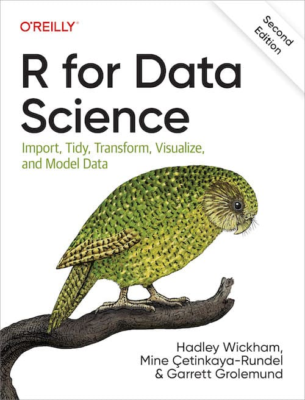
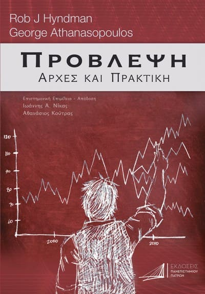
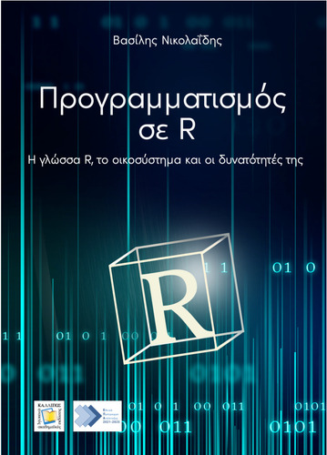
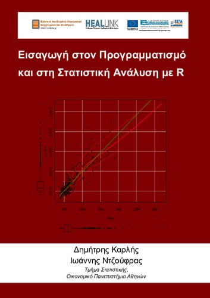

## Εισαγωγή

Καλησπέρα σας.

Πρώτο άρθρο στα ελληνικά και ελπίζω να μην τα γράφω τζάμπα και κάποιος, κάπου, κάποτε να βρει αυτή τη σελίδα αν ποτέ τη χρειαστεί 😁. Εγώ ασχολούμαι με την  από το 2018 περίπου. Ένα από τα πράγματα που με εντυπωσίασαν είναι η κοινότητά της που είναι πρόθυμη να βοηθήσει τους νέους χρήστες. Αρκετοί νέοι χρήστες έχουν βρει βοήθεια σε προβλήματα με τη γλώσσα είτε στο   [Stackoverflow](https://stackoverflow.com/questions/tagged/r), στο  [Mastodon](https://fosstodon.org/tags/rstats) ή στο κανάλι  [\/rstats](https://www.reddit.com/r/rstats/) του Reddit. Βέβαια, η συνεισφορά της κοινότητας δεν σταματάει εκεί, αφού πολλοί έχουν συμβάλει γράφοντας ακόμα και βιβλία για την  καθιστώντας μία απαιτητική γλώσσα προγραμματισμού πιο προσβάσιμη στο ευρύ κοινό. Πλειάδα αυτών των βιβλίων διατίθεται δωρεάν στο διαδίκτυο με πιο γνωστό από όλα το [R for Data Science](https://r4ds.had.co.nz/), το οποίο ήταν και το πρώτο βιβλίο που διάβασα για την R. Εκτός από την κοινότητα και το απεριόριστο δωρεάν υλικό, 
έχουν δημιουργηθεί και ομάδες που προωθούν την R σε κοινότητες που υποεκπροσωπούνται στο πεδίο της επιστήμης δεδομένων (π.χ. κοινότητες [R-ladies](https://rladies.org/), etc.), γεγονός που την καθιστά συμπεριληπτική.

:::{.column-margin}
{height=100px}
:::

Στα αγγλικά η συλλογή δωρεάν υλικού είναι χαώδης και πραγματικά για το κάθε πεδίο υπάρχει και ένα βιβλίο. Ενδεικτικά, από τη σελίδα [bookdown](https://bookdown.org/home/archive/), η οποία φιλοξενεί μία από τις βασικές και εκτεταμένες συλλογές δωρεάν βιβλίων για την R (πάνω από 1500 βιβλία), μπορώ να διακρίνω βιβλία τόσο για την R και για διάφορα πακέτα της (σχετικά με την ανάλυση, οπτικοποίηση και πρόβλεψη δεδομένων), όσο και για πιο εξειδικευμένα θέματα όπως [Μετα-ανάλυση](https://bookdown.org/MathiasHarrer/Doing_Meta_Analysis_in_R/), [Οικονομετρία](https://www.econometrics-with-r.org/), κ.ά. Ωστόσο, τι γίνεται με την πρόσβαση σε ελληνικό περιεχόμενο για την R; Πρόσφατα (το 2024) ο [Hadley Wickham](https://fosstodon.org/@hadleywickham/112299845231321009) με δημοσίευσή του στο Mastodon έδωσε ίσως το καλύτερο νέο για τους Έλληνες χρήστες, όπου πλέον υπάρχει και ελληνική μετάφραση του γνωστού βιβλίου R for Data Science, [Η R για την Επιστήμη Δεδομένων](https://gr.r4ds.hadley.nz/).

:::{.column-margin}

Το `{bookdown}` είναι ένα λογισμικό που δίνει τη δυνατότητα στους χρήστες της R να φτιάχνουν εύκολα έγγραφα ή και βιβλία. Η χρήση του συνεπώς γίνεται ως επί το πλείστον από χρήστες της R. Παρ' όλα αυτά, στη συλλογή δεν αποκλείεται να δείτε και μη σχετικά βιβλία ή ακόμα και βιβλία για τη Python.
:::

Βέβαια δεν είναι μόνο το βιβλίο RfDS, αφού και άλλοι μικροί ήρωες της καθημερινότητας έχουν προσφέρει υλικό για την R στα ελληνικά. Προκειμένου να συμπεριληφθεί κάτι στη σελίδα θα πρέπει να πληρεί τις εξής προϋποθέσεις :

1. Να είναι δωρεάν 
2. Να είναι στα ελληνικά
3. Να είναι κατανοητό για όλο το φάσμα των χρηστών της R

## Βιβλία για την R

Συνολικά 8 βιβλία έχουν βρεθεί να είναι ελεύθερα διαθέσιμα ηλεκτρονικά. Τα τέσσερα από αυτά αποτελούν βιβλία από το [Κάλλιπο](https://repository.kallipos.gr/), όπου διαθέτει ηλεκτρονικά συγγράμματα για διάφορα επιστημονικά πεδία.

::: {.table-responsive}
| Τίτλος βιβλίου | Συγγραφέας | Σύνδεσμος |
| :---:        |    :----:   |    :---: | 
| Η R για την Επιστήμη των Δεδομένων    (2η έκδοση)   | Hadley Wickham   Mine Çetinkaya-Rundel   Garrett Grolemund   P Togias (tr)   MT Pandi (tr) | <a href="https://gr.r4ds.hadley.nz/" target="_blank">Σύνδεσμος</a> |
| Πρόβλεψη (Αρχές και Πρακτική)   | Hyndman, R.J.   Athanasopoulos, G. | <a href="https://otexts.com/fppgr/" target="_blank">Σύνδεσμος</a> |
| Εισαγωγή στην R   Πρόχειρες σημειώσεις  | Φωκιανός, Κ.   Χαραλάμπους, Χ. | <a href="https://cran.r-project.org/doc/contrib/mainfokianoscharalambous.pdf" target="_blank">Σύνδεσμος</a>   (απευθείας κατέβασμα)|
| Προγραμματισμός σε R  | Νικολαΐδης, Β. | <a href="https://repository.kallipos.gr/handle/11419/8588" target="_blank">Σύνδεσμος</a>|
| Εισαγωγή στον προγραμματισμό και στη στατιστική ανάλυση με R   | Ντζούφρας, Ι.   Καρλής, Δ. | <a href="https://repository.kallipos.gr/handle/11419/2601" target="_blank">Σύνδεσμος</a> |
|  Η επιστήμη των δεδομένων μέσα από τη γλώσσα R   | Βερύκιος, Β.   Καγκλής, Β.   Σταυρόπουλος, Η. | <a href="https://repository.kallipos.gr/handle/11419/2965" target="_blank">Σύνδεσμος</a> |
|  Εισαγωγή στην επιχειρησιακή έρευνα και στον γραμμικό προγραμματισμό   | Κουνέτας, Κ   Χατζησταμούλου, Ν. | <a href="https://repository.kallipos.gr/handle/11419/5699" target="_blank">Σύνδεσμος</a> |
|  Εισαγωγή στην εκπαιδευτική και ψυχολογική μέτρηση με τη χρήση της R   | Albano, A.   Markos, A. (tr)| <a href="https://repository.kallipos.gr/handle/11419/8143" target="_blank">Σύνδεσμος</a> |
:::

Όπως είναι προφανές, οι επιλογές μας σε σχέση με το υλικό που υπάρχει στα αγγλικά (ελεύθερα διαθέσιμο) είναι περιορισμένες. Ωστόσο, υπάρχουν κάποιες πολύ καλές επιλογές (ανάλογα το επίπεδο και τον σκοπό του χρήστη). 

Η καλύτερη επιλογή (από το 2024) θεωρώ ότι είναι το πλέον μεταφρασμένο βιβλίο R for Data Science, [Η R για την Επιστήμη των Δεδομένων](https://gr.r4ds.hadley.nz/). Αυτό το βιβλίο κατά τη γνώμη μου είναι το πιο πλήρες, δεδομένου ότι μας βάζει στη λογική ότι η ανάλυση των δεδομένων δεν είναι απλά ένα διάγραμμα ή ένα μοντέλο. Αυτό είναι το αποτέλεσμα της ανάλυσης. Το βιβλίο με πολύ ωραίο τρόπο περιγράφει τη διαδικασία που προηγείται αυτού, όπως τη συλλογή, τη μεταφόρτωση των δεδομένων. Συνεχίζει με τον μετασχηματισμό αυτών προκειμένου να αποκτήσουν μορφή έτοιμη για ανάλυση. Τέλος, αξίζει να σημειωθεί ότι το βιβλίο δίνει έμφαση στο μετα-πακέτο (συλλογή από πακέτα) `{tidyverse}`, που είναι το πιο ευρέως χρησιμοποιούμενο στις μέρες μας και περιέχει αρκετά γνωστά πακέτα όπως το `{readr}` (μεταφόρτωση δεδομένων), `{dplyr}` (μετασχηματισμό δεδομένων), `{tidyr}` (τακτοποίηση δεδομένων), `{ggplot2}` (οπτικοποίηση) κ.ά. Αυτό είναι σημαντικό καθώς ορισμένα από τα επόμενα βιβλία είναι πιο παλιά και βασίζονται στη λεγόμενη base R (εντολές που περιλαμβάνονται στην R) για την όποια ανάλυση. Από την εμπειρία μου, η χρήση του tidyverse είναι προτιμητέα αρχικά επειδή υπάρχει πολύ διαθέσιμο υλικό (ιστοσελίδες / documentation) έχει αρκετή υποστήριξη (τόσο από την κοινότητα της R, όσο και από την [Posit](https://posit.co/), πρώην RStudio) και είναι πιο εύκολη στη χρήση. Αν δεν σας έχω πείσει ακόμα, να σας ενημερώσω ότι πολλά από τα εντυπωσιακά διαγράμματα που βλέπετε κατά καιρούς στο Twitter (συνήθως στο hashtag #TidyTuesday) ή σε εφημερίδες / τηλεοπτικά δίκτυα (π.χ. [BBC](https://github.com/bbc/bbplot)) χρησιμοποιούν το πακέτο ggplot2 της R για τα γραφήματά τους.

:::{.column-margin}
{height=200px}

Το βιβλίο [R for Data Science](https://gr.r4ds.hadley.nz/) («Η R για την Επιστήμη των Δεδομένων») είναι ένα βιβλίο που ασχολείται με τη σύγχρονη R (με βάση το πακέτο tidyverse), η πρώτη αγγλική έκδοση εκδόθηκε το 2017 και η δεύτερη το 2023. Η πρωτότυπη, αγγλική, έκδοση έχει συγγραφεί από τους Hadley Wickham, Mine Cetinkaya-Rundel και Garrett Grolemund. Η ελληνική έκδοση μεταφράστηκε από τους Παναγιώτη Τόγια και Θεοδώρα Πανδή.
:::

Η δεύτερη επιλογή μου (και η μέχρι πρότινος αγαπημένη μου, όταν δεν υπήρχε η μετάφραση του RfDS) είναι το βιβλίο «**Εισαγωγή στην R - Πρόχειρες σημειώσεις**» των κυρίων Φωκιανού και Χαραλάμπους. Είναι ένας συνδυασμός σημειώσεων και εφαρμογής των εντολών για κατηγορίες προβλημάτων. Αναφέρεται σε ένα μεγάλο εύρος θεμάτων (κυρίως στατιστικής). Πιο συγκεκριμένα από τα πιο απλά (έλεγχοι t-test) μέχρι πιο σύνθετα θέματα (ανάλυση κατά συστάδες). Ένα πολύ ωραίο στοιχείο είναι ότι κάθε κεφάλαιο συνοδεύεται από ένα μικρό παράδειγμα κώδικα R, κάτι που το καθιστά πολύ καλό για φοιτητές στατιστικής (μάλλον για αυτό μου αρέσει). Οι συγκεκριμένες σημειώσεις έχουν μόνο δύο μικρά μειονεκτήματα που αφορούν στην πληρότητα και την υλοποίηση του κώδικα. Το βιβλίο αναλύει ένα τεράστιο εύρος θεμάτων στατιστικής σε σχεδόν 300 σελίδες και κάπου εδώ προκύπτει ένα εμπόδιο. Κατά πόσο αναλύονται όλα τα στοιχεία που οφείλει να γνωρίζει ένας στατιστικός ή ένας τυπικός αναγνώστης με σχετικά ενδιαφέροντα; Οι συγγραφείς του βιβλίου αποφάσισαν να γράψουν ένα βιβλίο που θα εκθέτει τον αναγνώστη στις διάφορες μεθοδολογίες και να του κεντρίσουν τη προσοχή και να του δώσουν μία σύνοψη για τις βασικές έννοιες και θεωρίες που χειριζόμαστε στο προπτυχιακό επίπεδο. Αυτή η απόφαση είναι σημαντική, αφού δίνεις χώρο στον αναγνώστη να πάρει ιδέες, να μάθει και εν τέλει να συνθέσει μόνος του ένα κεφάλαιο μιας μεθοδολογίας που τον απασχολεί. Ο περιορισμός λοιπόν είναι στο ότι για να το κάνει αυτό θυσίασε μία πιο εμπεριστατωμένη ανάλυση της θεωρίας που να συνοδεύει το κεφάλαιο. Γενικότερα το κάθε κεφάλαιο είναι περίπου 10 σελίδες, επομένως αν θέλουμε να μάθουμε περισσότερα πράγματα, θα χρειαστεί να ανατρέξουμε σε πρόσθετες πηγές. Τέλος, υπάρχει άλλο ένα μικρό πρόβλημα στην υλοποίηση του κώδικα, δίχως αυτό δεν αποτελεί λάθος των συγγραφέων. Οι σημειώσεις δημοσιεύτηκαν το 2012 και βασίζονται στη διάλεκτο base R. Σε αντιπαραβολή με τη διάλεκτο tidyverse R, δεν παρέχει χρήσιμες λειτουργίες όπως τον τελεστή pipe `%>%`. Αυτό όμως δεν μας επηρεάζει πολύ, δεδομένου ότι το βιβλίο περιορίζεται στην υλοποίηση του στατιστικού ελέγχου και όχι σε μία αλληλουχία εντολών επεξεργασίας των δεδομένων. Αν μας ενδιαφέρει αποκλειστικά η υλοποίηση του στατιστικού ελέγχου, το βιβλίο κάνει χρήση εντολών που έχουν στην ουσία καθιερωθεί και χρησιμοποιούνται καθολικά από όλο το φάσμα των R χρηστών. Στην περίπτωση διαγραμμάτων αποθαρρύνω τη χρήση της εντολής `plot()`, αλλά αν θέλετε να φτιάξετε εντυπωσιακά διαγράμματα και να έχετε έλεγχο σε περισσότερα στοιχεία του γραφήματος προτείνω να μη σταθείτε στην υλοποίηση του βιβλίου, αλλά να αφιερώσετε χρόνο για τη ggplot2. Για τα διαγράμματα με το πακέτο `{ggplot2}` μπορείτε να διαβάσετε το κεφάλαιο 9 του βιβλίου του Hadley.

Μία τρίτη επιλογή είναι το βιβλίο «Πρόβλεψη (Αρχές και Πρακτική)» το οποίο αποτελεί την ελληνική μετάφραση του γνωστού βιβλίου Forecasting: Principles and Practice. Αυτό το βιβλίο είναι αξιόλογο, όμως δεν αποτελεί βιβλίο εκμάθησης της R. Απευθύνεται σε έναν καλό γνώστη της γλώσσας που τον ενδιαφέρει η θεωρία των χρονοσειρών, αναγνώριση υποδειγμάτων και πρόβλεψη αυτών. Στο βιβλίο γίνεται καλή ανάλυση της θεωρίας η οποία συνδυάζεται με την αντίστοιχη πρακτική εφαρμογή στη γλώσσα R. Για αυτό το λόγο θεωρώ ότι είναι ένα από τα ποιοτικότερα βιβλία στην κατηγορία του μιας και δεν εφαρμόζεις απλά εντολές, αλλά μαθαίνεις τη θεωρία και μέσα από αυτή κατανοείς τους λόγους για τους οποίους εφαρμόζουμε διάφορα υποδείγματα ή τι εντολές χρειάζεται να εκτελέσουμε. Για τις χρονοσειρές είναι ευρέως χρησιμοποιούμενο το `{forecast}` πακέτο, ωστόσο στο βιβλίο θα δείτε να χρησιμοποιούνται εξειδικευμένα πακέτα χρονοσειρών της σουίτας `{tidyverts}` (π.χ. `{fable}`). Είναι το αντίστοιχο του `{tidyverse}`, αλλά εξειδικευμένο για την τακτοποίηση των χρονοσειρών. Το πρωτότυπο βιβλίο έχει γραφτεί στα αγγλικά, αλλά έχει γίνει μία καλή μετάφραση η οποία συμπεριλαμβάνει και τους αντίστοιχους ελληνικούς επιστημονικούς όρους που είναι χρήσιμο σε εξειδικευμένα πεδία που οι περισσότερες πηγές είναι στα αγγλικά. Το εύρος των θεμάτων με τα οποία καταπιάνεται είναι από χρονοσειρές Box-Jenkins (ARIMA), εκθετική εξομάλυνση, μοντέλα δυναμικής παλινδρόμησης και πιο σύνθετες τεχνικές πρόβλεψης.

:::{.column-margin}
{height=200px}

Hyndman, R.J., & Athanasopoulos, G. (2021) Forecasting: principles and practice, 3rd edition, OTexts: Melbourne, Australia. [σύνδεσμος ελληνικής έκδοσης του βιβλίου](https://otexts.com/fppgr/)
:::

Ένα βιβλίο το οποίο δεν είχα προσέξει είναι το «Προγραμματισμός σε R». Αυτό θυμίζει περισσότερο το βιβλίο του Hadley που ασχολείται με τη σύγχρονη εκδοχή της R. Ξεκινάει αναλύοντας τις ιδιοτροπίες της R, τα αντικείμενά της. Συνεχίζει αναλύοντας βασικές λειτουργίες του προγραμματισμού όπως τους ελέγχους ροής, βρόχους επανάληψης και τη δημιουργία συναρτήσεων. Το βιβλίο κλείνει με αναφορά πιο σύνθετων θεμάτων σχετικά με αντικειμενοστραφή προγραμματισμό (βασικά εξηγώντας το χάος αυτού στην R) και με μία εισαγωγή στον τρόπο δημιουργίας πακέτων στην R. Μία φιλότιμη προσπάθεια και ένα βιβλίο που αξίζει να διαβαστεί με στόχο να κατανοήσουμε περισσότερο τη γλώσσα R και τις ιδιοτροπίες της. Το σημείο που χάνει το βιβλίο είναι η μη σημαντική αναφορά σε στατιστικές μεθόδους σε σχέση με τις σημειώσεις των Φωκιανού, Χαραλάμπους και αυτό μπορεί να δυσαρεστήσει μερικούς αναγνώστες, καθώς ο λόγος ασχολίας μας με την R είναι η ανάλυση των δεδομένων και η στατιστική ανάλυση. Τέλος, ένα αρνητικό που υπάρχει είναι η μικρή του έκταση, που οδηγεί σε σημαντική θεματική επικάλυψη με το βιβλίο του Hadley, γεγονός που ίσως να μην είναι η πρώτη επιλογή τώρα που το προαναφερόμενο βιβλίο έχει ελληνική μετάφραση.

:::{.column-margin}
[{height=200px}](https://repository.kallipos.gr/handle/11419/8588)
:::

Η τέταρτη επιλογή «Εισαγωγή στον προγραμματισμό και στη στατιστική ανάλυση με R» των Ντζούφρα & Καρλή κινείται σε παρόμοια νερά. Είναι ένα βιβλίο που με προβλημάτισε κάπως. Αυτό το βιβλίο είχε τα φόντα να γίνει το προσωπικό μου αγαπημένο, διότι δεν σου δείχνει απλά τις εντολές. Σου μαθαίνει να προγραμματίζεις με την R, αφού δίνει μεγαλύτερη σημασία σε ελέγχους ροής, συναρτήσεις και άλλα θέματα. Αυτό είναι πολύ σημαντικό, αν θες να φτιάξεις κάτι πιο περίπλοκο (π.χ. μία περίπλοκη ανάλυση, ένα πακέτο στην R, κτλ.). Αν και ο προγραμματισμός μαθαίνεται κυρίως κάνοντας και όχι απλώς διαβάζοντας, πιστεύω ότι είναι μία σημαντική προσθήκη στη λίστα. Κερδίζει επιπλέον πόντους για το ότι είχε κεφάλαια στα οποία έκανε βασική στατιστική ανάλυση. Αν και το βιβλίο είναι ελαφρώς πιο καλογραμμένο από το προηγούμενο έχει δημοσιευτεί το 2015 και έχει κώδικα σε base R και για αυτό δεν είναι στις πρώτες μου επιλογές.

:::{.column-margin}
[{height=200px}](https://repository.kallipos.gr/handle/11419/2601)
:::

Η πέμπτη μου επιλογή είναι το «Επιστήμη των δεδομένων μέσα από τη γλώσσα R». Πιθανότατα αυτό το βιβλίο πλησιάζει περισσότερο στη λογική των notebooks και στο να ανεβάσεις δικά σου project. Σε ωθεί να αρχίσεις να κάνεις αναλύσεις. Αυτό είναι ένα θετικό στοιχείο, αν κάποιος θέλει να πειραματιστεί με τη γλώσσα ή αν θέλει να φτιάξει τα δικά του project. Το τελευταίο είναι **πολύ** σημαντικό για να βρεις εργασία (εγώ με αυτή την ελπίδα ζω ακόμα), αφού το πεδίο της ανάλυσης και της επιστήμης δεδομένων είναι ανταγωνιστικό ως προς τους νέους απόφοιτους χωρίς σχετική προϋπηρεσία. Η γνώμη μου είναι ότι είναι καλό για κάποιον που έχει ήδη κάποια εξοικείωση στην R. Ο κύριος λόγος για τον οποίο χάνει πόντους είναι η παλαιότητά του (έκδοση του 2015). Αν αγνοήσουμε αυτό, το στοιχείο που ξεχωρίζει το βιβλίο είναι η αμεσότητα και το κίνητρο που σου δίνει να φτιάξεις τα δικά σου project.

Τα τελευταία 2 βιβλία της λίστας μου ασχολούνται με εξειδικευμένα θέματα και γίνεται χρήση της R συνεπικουρικά. Κάτι τέτοιο δεν καθιστά τα βιβλία ακατάλληλα, απλώς η χρήση αυτών ενδείκνυται σε πιο προχωρημένους χρήστες.

## Βίντεομαθήματα για την R

Πέρα όμως από τα βιβλία έψαξα να βρω και υλικό για την R στο Youtube. Το υλικό είναι επίσης περιορισμένο. Προς το παρόν θα αφήσω μία επιλογή η οποία είναι και η πιο πλήρης. Στη σειρά βιντεομαθημάτων (playlist) του κ. Χρήστου Μαλλιαράκη γίνεται μία αναφορά σε βασικά στοιχεία της R ενώ σε επόμενα μαθήματα ασχολείται με απλά παραδείγματα μηχανικής μάθησης. 

| Όνομα καναλιού | Σύνδεσμος |
| :---: |  :---: | 
|   Christos Malliarakis  | <a href="https://www.youtube.com/watch?v=6hKAwLUbgjQ&list=PLB8VXMjsTRosUahxJqnAWNQM3h66kJSjc" target="_blank">Σύνδεσμος</a> |

## Επίλογος

Προφανώς η συμπερίληψη ελληνικών πηγών είναι ενθαρρυντική, τόσο για τη δημοφιλία της R στην Ελλάδα, όσο και για τη δημιουργία ενεργής κοινότητας. Ωστόσο, σε καμία περίπτωση δεν μπορεί να αποτελέσουν αυτές οι πηγές εναλλακτική, αλλά μία χρήσιμη προσθήκη. Συνοπτικά, αν είστε ένας χρήστης που θέλει να μάθει την R, σας προτείνω το βιβλίο R for Data Science καθώς είναι το μόνο βιβλίο που χρησιμοποιεί τα πιο πρόσφατα πακέτα της. Μία σύγχρονη εναλλακτική θα μπορούσε να αποτελέσει το βιβλίο του Νικολαΐδη «Προγραμματισμός σε R». Σε περίπτωση που θέλουμε να λύσουμε πρόβλημα χρονοσειρών τότε μόνο θα πρότεινα ως το ιδανικότερο το «Πρόβλεψη» των Hyndman & Αθανασόπουλου. 

Όσον αφορά τα υπόλοιπα βιβλία έχω τους ενδοιασμούς μου όχι τόσο στο αν είναι χρήσιμα (ναι, είναι), αλλά στο κατά πόσο θα τα πρότεινα. Τα άλλα βιβλία χρησιμοποιούν ως επί το πλείστον εντολές που βασίζονται στη base R, το οποίο δεν είναι απαραίτητα κακό, αλλά η R έχει εξελιχθεί και πλέον υπάρχουν αποδοτικότεροι τρόποι/πακέτα για να κάνουμε μία αντίστοιχη ανάλυση. Ορισμένα τα κρίνω ακόμα εξαιρετικά για να εισάγεις τον χρήστη στην ανάλυση δεδομένων όπως οι σημειώσεις του Φωκιανού, αλλά η σύγχρονη και πιο αποδοτική πρακτική τείνει να είναι η tidyverse R. Προσωπικά πέρα από πολύ απλούς στατιστικούς ελέγχους, δεν έχω δει κάποιον που να χρησιμοποιεί base R σε εκτεταμένο επίπεδο. Καλό είναι να γνωρίζουμε τα βασικά στοιχεία της γλώσσας που θέλουμε να γίνουμε γνώστες, αλλά να έχουμε υπόψιν μας ότι η κοινότητα έχει καταλήξει σε άλλες λύσεις.

Καλό διάβασμα. 📖