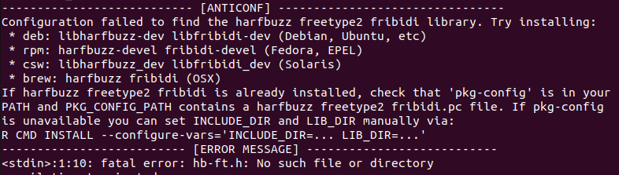

## Εισαγωγή

Η ενασχόληση με τη μηχανική μάθηση είναι ένας ενδιαφέρων αλλά μακρύς δρόμος.
Οι περισσότεροι ξεκινούν με κάποιες βασικές έννοιες και στη συνέχεια προσπαθούν
να τις εφαρμόσουν με απλές μεθόδους. Μία από τις πρώτες προσεγγίσεις που
συναντάμε είτε σε οδηγούς εκμάθησης, είτε στο πανεπιστήμιο είναι η
λογιστική και η γραμμική παλινδρόμηση. Πρόκειται για τεχνικές εύκολα
κατανοητές ως προς τη λειτουργία τους, που προσφέρουν ένα αποδεκτό επίπεδο
ακρίβειας. Σε προβλήματα πρόβλεψης όμως, υπάρχουν πλέον αξιόλογες
εναλλακτικές με υψηλότερη προβλεπτική ικανότητα. Μία από αυτές είναι οι
αλγόριθμοι ενίσχυσης βαθμίδας (Gradient Boosting Machines — GBMs), οι οποίοι
βελτιώνουν σε μεγάλο βαθμό τις προβλέψεις του μοντέλου μας, χωρίς να είναι
ιδιαίτερα απαιτητικοί στη χρήση τους.

Πριν τους χρησιμοποιήσουμε (π.χ. μέσω του πακέτου `{tidymodels}`)
θα πρέπει να εγκαταστήσουμε τα αντίστοιχα λογισμικά. Σε αυτό το άρθρο
συνοψίζουμε τις οδηγίες εγκατάστασης για καθέναν από αυτούς.


| Μοντέλο  | Τεκμηρίωση |
| :------: | :--------: |
| LightGBM | [Σύνδεσμος](https://lightgbm.readthedocs.io/en/v3.3.2/Installation-Guide.html) |
| CatBoost | [Σύνδεσμος](https://catboost.ai/en/docs/concepts/installation) |
| XGBoost  | [Σύνδεσμος](https://xgboost.readthedocs.io/en/stable/install.html) |
: Αλγόριθμοι Boosting και ιστοσελίδες τεκμηρίωσης {#tbl-documentation-list-gbm}

```{r}
#| label: fig-trends-gbm
#| fig-cap: "Ιστόγραμμα τάσεων αναζήτησης των GBMs"
#| fig-cap-location: bottom
#| warning: false
#| message: false
#| eval: false

library(highcharter)
library(gtrendsR)
library(dplyr)

googleTrendsData <- gtrendsR::gtrends(
  keyword      = c("LightGBM", "CatBoost", "XGBoost"),
  gprop        = "web",
  onlyInterest = TRUE
)

interestOverTime <- googleTrendsData[["interest_over_time"]] %>%
  dplyr::mutate(date = lubridate::ymd(date)) %>%
  dplyr::mutate(Year = lubridate::year(date)) %>%
  select(Year, keyword, hits) %>%
  group_by(Year, keyword) %>%
  summarise(Average = round(mean(hits), digits = 1), .groups = "drop")

highchart() %>%
  hc_chart(type = "line") %>%
  hc_title(text = "Ενδιαφέρον αναζήτησης στις μηχανές αναζήτησης") %>%
  hc_subtitle(text = "Σύγκριση τάσεων μεταξύ των αλγόριθμων ενίσχυσης βαθμίδας (GBMs).") %>%
  hc_xAxis(categories = unique(interestOverTime$Year)) %>%
  hc_yAxis(title = list(text = "Τάση")) %>%
  hc_add_series(
    name = "XGBoost",
    data = interestOverTime %>% filter(keyword == "XGBoost") %>% pull(Average)
  ) %>%
  hc_add_series(
    name = "CatBoost",
    data = interestOverTime %>% filter(keyword == "CatBoost") %>% pull(Average)
  ) %>%
  hc_add_series(
    name = "LightGBM",
    data = interestOverTime %>% filter(keyword == "LightGBM") %>% pull(Average)
  )
```

## LightGBM

Το LightGBM αναπτύχθηκε από τη Microsoft και κυκλοφόρησε το 2016. Το βασικό του πλεονέκτημα είναι η ταχύτητα και η χαμηλή κατανάλωση μνήμης. Αυτό το κάνει ιδανική επιλογή όταν εργαζόμαστε με πολύ μεγάλα σύνολα δεδομένων, όπου άλλες υλοποιήσεις μπορεί να γίνουν αργές ή να εξαντλήσουν τη διαθέσιμη μνήμη.

### Επιλογή 1 — Εγκατάσταση του πακέτου R

Ο απλούστερος τρόπος εγκατάστασης για χρήστες R είναι μέσω του αντίστοιχου πακέτου `{lightgbm}`, απευθείας από το CRAN:

```{r}
#| label: install-lightgbm
#| echo: true
#| eval: false

elapsed_lightgbm <- system.time(
  install.packages("lightgbm", repos = "https://cran.r-project.org")
)[["elapsed"]]
```

### Επιλογή 2 — Εγκατάσταση μέσω CMake

Αν προτιμάμε να κάνουμε build από τον πηγαίο κώδικα, η σελίδα
[τεκμηρίωσης](https://lightgbm.readthedocs.io/en/latest/Installation-Guide.html#linux) του LightGBM περιγράφει τη διαδικασία αναλυτικά. Οι βασικές εντολές για Linux είναι οι εξής:

```{.bash filename="Terminal"}
sudo apt install cmake
```

```{.bash filename="Terminal"}
git clone --recursive https://github.com/microsoft/LightGBM
cd LightGBM
mkdir build
cd build
cmake ..
make -j4
```


## CatBoost

Το CatBoost αναπτύχθηκε από την Yandex και κυκλοφόρησε το 2017. Διαφέρει από τις άλλες υλοποιήσεις κυρίως στον τρόπο με τον οποίο χειρίζεται τα
**κατηγορικά χαρακτηριστικά** (*categorical features*): ενώ συνήθως απαιτείται
προεπεξεργασία (π.χ. one-hot encoding), το CatBoost μπορεί να τα διαχειριστεί
απευθείας, χωρίς μετατροπή. Αυτό το καθιστά ιδιαίτερα χρήσιμο σε σύνολα
δεδομένων με πολλές κατηγορικές μεταβλητές, όπως συχνά συμβαίνει σε
εμπορικές και οικονομικές εφαρμογές. Επιπλέον, τείνει να απαιτεί λιγότερο
fine-tuning υπερπαραμέτρων σε σχέση με τις εναλλακτικές.

Για το CatBoost δεν υπάρχει αντίστοιχο πακέτο στο CRAN, οπότε χρησιμοποιούμε
τη συνάρτηση `install_url()` του `{devtools}`, περνώντας έναν σύνδεσμο από την
[επίσημη σελίδα εκδόσεων](https://github.com/catboost/catboost/releases) στο
GitHub.

:::{.callout-warning}
Κατά την εγκατάσταση του `{devtools}` ενδέχεται να εμφανιστεί σφάλμα λόγω
απουσίας των βιβλιοθηκών συστήματος `libharfbuzz-dev` και `libfribidi-dev`.
Αν αντιμετωπίσουμε αυτό το πρόβλημα (που παρατηρείται συχνά σε Ubuntu 22),
αρκεί να τις εγκαταστήσουμε και να επανεκκινήσουμε το RStudio:

```{.bash filename="Terminal"}
sudo apt install libharfbuzz-dev libfribidi-dev
```
:::



```{r}
#| label: install-catboost
#| echo: true
#| eval: false

elapsed_catboost <- system.time(
  devtools::install_url(
    "https://github.com/catboost/catboost/releases/download/v1.1.1/catboost-R-Linux-1.1.1.tgz",
    INSTALL_opts = c("--no-multiarch", "--no-test-load")
  )
)[["elapsed"]]
```


## XGBoost

Το XGBoost (*Extreme Gradient Boosting*) αναπτύχθηκε από τον Tianqi Chen και
παρουσιάστηκε το 2016. Είναι ιστορικά η πιο διαδεδομένη υλοποίηση μεταξύ
των GBMs: κέρδισε δεκάδες διαγωνισμούς στο Kaggle και έγινε σχεδόν συνώνυμο
με τον όρο «gradient boosting» για αρκετά χρόνια. Ξεπερνά συστηματικά τις
κλασικές μεθόδους (λογιστική/γραμμική παλινδρόμηση, Naive Bayes κ.ά.) και
προσφέρει πλούσιες επιλογές ρύθμισης υπερπαραμέτρων. Αξίζει να σημειωθεί
ότι σε προβλήματα με πολύ μεγάλα δεδομένα μπορεί να
υστερεί σε ταχύτητα έναντι του LightGBM.

Η εγκατάσταση είναι εξίσου απλή με αυτή του `{lightgbm}`:

```{r}
#| label: install-xgboost
#| echo: true
#| eval: false

elapsed_xgboost <- system.time(
  install.packages("xgboost")
)[["elapsed"]]
```


## Σύνοψη

Οι αλγόριθμοι ενίσχυσης βαθμίδας προσφέρουν αυξημένη προβλεπτική ικανότητα
σε σχέση με τις κλασικές μεθόδους μηχανικής μάθησης, και η εγκατάστασή τους
στην R είναι σχετικά απλή υπόθεση.

Ως μικρό πείραμα, χρονομετρήσαμε την εγκατάσταση κάθε πακέτου με τη συνάρτηση
`system.time()`. Τα αποτελέσματα συνοψίζονται στον παρακάτω πίνακα:

:::{.callout-note}
Οι χρόνοι μετρήθηκαν σε συγκεκριμένο σύστημα και σύνδεση δικτύου. Ενδέχεται
να διαφέρουν ανάλογα με το hardware, την έκδοση R και την ταχύτητα internet.
:::

:::{.table-responsive}
| Μοντέλο  | Μέθοδος εγκατάστασης  | Χρόνος εγκατάστασης |
| :------: | :-------------------: | :-----------------: |
| LightGBM | R πακέτο              | 7.79 λεπτά          |
| CatBoost | Σύνδεσμος έκδοσης     | 2.1 λεπτά           |
| XGBoost  | R πακέτο              | 6.16 λεπτά          |
: Χρόνοι εγκατάστασης αλγόριθμων ενίσχυσης βαθμίδας {#tbl-install-times}
:::
