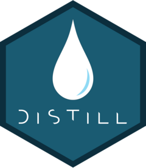

```{r}
#| label: load_packages
#| title: "Load packages"
#| message: false
#| warning: false
#| include: false
library(fontawesome)
```

## Introduction

::: {.callout-note}
I have decided to also maintain this list as a project on the corresponding <i class="bi bi-github"></i> [GitHub Repo page](https://github.com/stesiam/Quarto-Websites)
:::

At the time of writing, Quarto has surpassed other website-building packages in popularity (3.4k <i class="bi bi-star-fill"></i> stars), compared to packages like [blogdown](https://github.com/rstudio/blogdown) (1.7k <i class="bi bi-star-fill"></i>) and [distill](https://github.com/rstudio/distill) (400 <i class="bi bi-star-fill"></i>). Given Quarto's growing popularity, I took the initiative to compile a list of websites built with it. This way, data analysts who use other site-building methods (e.g., distill, blogdown) will have the chance to see what a Quarto website can do. Additionally, this catalogue may also help those who have already added Quarto to their toolkit, as they can draw inspiration from a centralised collection of relevant examples.


::: {.column-margin}
<center></center>
:::

Unfortunately, as is probably already obvious, this list cannot possibly include every Quarto website. For the most part, these are sites I have come across and liked. If you know of another site, or even your own, feel free to leave a comment or send me a message and I will add it as soon as possible.

## Inspiration

A few years earlier I decided to build a website so I would have a single place to showcase my projects rather than having them scattered across various repositories on GitHub. So I tried several solutions that needed to support Rmd files (R Markdown files). I ended up using `{distill}`, and I genuinely loved it, as the website combined simplicity with elements that made it look quite professional. Despite whatever issues it had (many of which were later resolved by Quarto), I was quite satisfied. However, at that time I was a beginner programmer with fairly limited knowledge of HTML and CSS. This meant I could only make minimal modifications, and even those would take me a very long time. During the same period I discovered a website that catalogued [Distill websites]([Distill websites together](https://distillery.rbind.io/showcase.html)). That list helped me:

::: {.column-margin}
<center>{height=100px}</center>
:::


- Understand the capabilities and limitations of `{distill}` package
- Find motivation to get started by drawing inspiration from other people's sites
- Easily access interesting site features alongside their corresponding source code


In 2022, [Quarto was announced](https://posit.co/blog/announcing-quarto-a-new-scientific-and-technical-publishing-system/) and the landscape of writing and publishing articles, reports, and websites changed considerably. Several Distill users decided to make the switch and are already using Quarto for their personal websites (based on the Distill website list). Some may still be hesitant about this change, since Quarto is fairly new and there may be significant issues that haven't been resolved yet. Another factor is the time required to learn how to use it, given that its [documentation](https://quarto.org/docs/guide/) is particularly extensive. This is precisely why I believe this list is important: to make Quarto more accessible to new users and to encourage existing users to adopt new features.

::: {.column-margin}
<center>{height=100px}</center>
:::

## List of Quarto Sites

An indicative list of websites using Quarto is as follows: 

|   `r fa("user") ` &nbsp; User     | `r fa("globe") ` &nbsp;  Website URL   |   `r fa("code") `  &nbsp; Repository   |
|:------------------:|:------------------:|:------------------:|
|  <a href="https://github.com/aeturrell" target="_blank">aeturell</a>  |  <a href="https://www.aeturrell.com" target="_blank">aeturrell.com</a> | <a href="https://github.com/aeturrell/home" target="_blank">home</a> |
|  <a href="https://github.com/alexpghayes" target="_blank">alexpghayes</a>  | <a href="https://www.alexpghayes.com/" target="_blank">alexpghayes.com</a> | <a href="https://github.com/alexpghayes/quarto-blog" target="_blank">quarto-blog</a> |
|   <a href="https://github.com/almeidasilvaf" target="_blank">almeidasilvaf</a>  | <a href="https://almeidasilvaf.github.io/" target="_blank">almeidasilvaf.github.io/</a> | <a href="https://github.com/almeidasilvaf/almeidasilvaf.github.io" target="_blank">almeidasilvaf.github.io</a> |
|  <a href="https://github.com/andreashandel" target="_blank">andreashandel</a> | <a href="https://www.andreashandel.com/" target="_blank">andreashandel.com/</a> | <a href="https://github.com/andreashandel/andreashandelwebsite" target="_blank">andreashandelwebsite</a> |
| <a href="https://github.com/andrewheiss" target="_blank">andrewheiss</a>  | <a href="https://www.andrewheiss.com/" target="_blank">andrewheiss.com</a> | <a href="https://github.com/andrewheiss/ath-quarto" target="_blank">ath-quarto</a> |
| <a href="https://github.com/andrewheiss" target="_blank">andrewheiss</a>  | <a href="https://nonprofitf22.classes.andrewheiss.com/" target="_blank">nonprofitf22.classes.andrewheiss.com</a> | <a href="https://github.com/andrewheiss/nonprofitf22.classes.andrewheiss.com" target="_blank">nonprofitf22.classes.andrewheiss.com</a> |
|  <a href="https://github.com/aster-hu" target="_blank">aster-hu</a>  | <a href="https://asterhu.com/" target="_blank">asterhu.com/</a> | <a href="https://github.com/aster-hu/Asteroid_Blog" target="_blank">Asteroid_Blog</a> |
| <a href="https://github.com/beatrizmilz" target="_blank">beatrizmilz</a>  |  <a href="https://beamilz.com/" target="_blank">beamilz.com</a> |         <a href="https://github.com/beatrizmilz/blog-en/" target="_blank">blog-en</a>    |
| <a href="https://github.com/Bioconductor" target="_blank">Bioconductor</a> | <a href="https://bioconductor.github.io/biocblog/" target="_blank">bioconductor.github.io/biocblog/</a> |  <a href="https://github.com/bioconductor/biocblog" target="_blank">biocblog</a> | 
| <a href="https://github.com/cgoo4" target="_blank">cgoo4</a> | <a href="https://www.quantumjitter.com/" target="_blank">quantumjitter.com/</a> |  <a href="https://github.com/cgoo4/quantumjitter" target="_blank">quantumjitter</a> | 
| <a href="https://github.com/CrumpLab" target="_blank">CrumpLab</a> | <a href="https://crumplab.com/" target="_blank">crumplab.com/</a> |  <a href="https://github.com/CrumpLab/CrumpLab.github.io" target="_blank">CrumpLab.github.io</a> | 
| <a href="https://github.com/currocam" target="_blank">currocam</a> | <a href="https://currocam.github.io/" target="_blank">currocam.github.io/biocblog/</a> |  <a href="https://github.com/currocam/currocam.github.io" target="_blank">currocam.github.io</a> | 
| <a href="https://github.com/cynthiahqy" target="_blank">cynthiahqy</a> | <a href="https://cynthiahqy.com/" target="_blank">cynthiahqy.com/</a> |  <a href="https://github.com/cynthiahqy/digital-garden" target="_blank">digital-garden</a> | 
| <a href="https://github.com/daxkellie" target="_blank">daxkellie</a> | <a href="https://daxkellie.com/" target="_blank">daxkellie.com</a> |  <a href="https://github.com/daxkellie/website-quarto" target="_blank">website-quarto</a> | 
| <a href="https://github.com/ddimmery" target="_blank">ddimmery</a> | <a href="https://ddimmery.com/" target="_blank">ddimmery.com</a> |  <a href="https://github.com/ddimmery/quarto-website" target="_blank">quarto-website</a> | 
|  <a href="https://github.com/djnavarro" target="_blank">djnavarro</a>  | <a href="blog.djnavarro.net/" target="_blank">blog.djnavarro.net/</a>  |   <a href="https://github.com/djnavarro/quarto-blog" target="_blank">quarto-blog</a>  |
|  <a href="https://github.com/drganghe" target="_blank">drganghe</a>  | <a href="https://drganghe.github.io/" target="_blank">drganghe.github.io</a>  |   <a href="https://github.com/drganghe/drganghe.github.io" target="_blank">drganghe.github.io</a>  |
|  <a href="https://github.com/ekholme" target="_blank">ekholme</a>  | <a href="https://www.ericekholm.com/" target="_blank">ericekholm.com/</a>  |   <a href="https://github.com/ekholme/ee-quarto-site" target="_blank">ee-quarto-site</a>  |
|  <a href="https://github.com/EllaKaye" target="_blank">EllaKaye</a>  | <a href="https://ellakaye.co.uk/" target="_blank">ellakaye.co.uk/</a>  |   <a href="https://github.com/EllaKaye/ellakaye.co.uk" target="_blank">ellakaye.co.uk </a>  |
|   <a href="https://github.com/EmilHvitfeldt" target="_blank">EmilHvitfeldt</a>  | <a href="https://emilhvitfeldt.com/" target="_blank">emilhvitfeldt.com</a>  |   <a href="https://github.com/EmilHvitfeldt/emilhvitfeldt.com" target="_blank">emilhvitfeldt.com</a>  |
|  <a href="https://github.com/epiforecasts" target="_blank">epiforecasts</a>  | <a href="https://epiforecasts.io/" target="_blank">epiforecasts.io/</a>  |   <a href="https://github.com/epiforecasts/epiforecasts.github.io" target="_blank">epiforecasts.github.io</a>  |
|  <a href="https://github.com/fusionet24" target="_blank">fusionet24</a>  | <a href="https://www.myyearindata.com/" target="_blank">myyearindata.com/</a>  |   <a href="https://github.com/fusionet24/myyearindata" target="_blank">myyearindata </a>  |
|  <a href="https://github.com/ivelasq" target="_blank">ivelasq</a>  | <a href="https://ivelasq.rbind.io/" target="_blank">ivelasq.rbind.io</a>  |   <a href="https://github.com/ivelasq/pipedream" target="_blank">pipedream</a>  |
|  <a href="https://github.com/JavOrraca" target="_blank">JavOrraca</a>  | <a href="https://www.javierorracadeatcu.com/" target="_blank">javierorracadeatcu.com/</a>  |   <a href="https://github.com/JavOrraca/quarto-blog" target="_blank">quarto-blog </a>  |
|  <a href="https://github.com/jbkunst" target="_blank">jbkunst</a>   | <a href="https://jkunst.com/blog/" target="_blank">jkunst.com/blog/</a> | <a href="https://github.com/jbkunst/blog" target="_blank">blog</a>  |
|  <a href="https://github.com/jessesadler" target="_blank">jessesadler</a>  | <a href="https://www.jessesadler.com/" target="_blank">jessesadler.com</a>| <a href="https://github.com/jessesadler/quarto-blog" target="_blank">quarto-blog</a> |
|  <a href="https://github.com/jeweljohnsonj" target="_blank">jeweljohnsonj</a>  | <a href="https://sciquest.netlify.app/" target="_blank">sciquest.netlify.app//</a>| <a href="https://github.com/jeweljohnsonj/SciQuest" target="_blank">SciQuest</a> |
|    <a href="https://github.com/jhelvy" target="_blank">jhelvy</a>    | <a href="https://www.jhelvy.com" target="_blank">jhelvy.com</a>  | <a href="https://github.com/jhelvy/jhelvy_quarto" target="_blank">jhelvy_quarto</a>  |
|  <a href="https://github.com/joelnitta" target="_blank">joelnitta</a>   | <a href="https://www.joelnitta.com/" target="_blank">joelnitta.com</a> | <a href="https://github.com/joelnitta/joelnitta-home" target="_blank">joelnitta-home</a>  |
|  <a href="https://github.com/journalovi" target="_blank">journalovi</a>   | <a href="https://www.journalovi.org/" target="_blank">journalovi.org</a> | <a href="https://github.com/journalovi/journalovi.github.io" target="_blank">journalovi.github.io</a>  |
|  <a href="https://github.com/jthomasmock" target="_blank">jthomasmock</a>   | <a href="https://themockup.blog/" target="_blank">TheMockup.blog</a> | <a href="https://github.com/jthomasmock/themockup-blog" target="_blank">themockup-blog</a>  |
|  <a href="https://github.com/kathoffman" target="_blank">kathoffman</a>   | <a href="https://www.khstats.com/" target="_blank">khstats.com/</a> | <a href="https://github.com/kathoffman/khstats-quarto" target="_blank">khstats-quarto</a>  |
|  <a href="https://github.com/kelly-sovacool" target="_blank">kelly-sovacool</a>   | <a href="https://sovacool.dev/" target="_blank">sovacool.dev//</a> | <a href="https://github.com/kelly-sovacool/kelly-sovacool.github.io" target="_blank">kelly-sovacool.github.io</a>  |
|  <a href="https://github.com/kurianbenoy" target="_blank">kurianbenoy</a>  | <a href="https://kurianbenoy.com/" target="_blank">kurianbenoy.com</a> | <a href="https://github.com/kurianbenoy/kurianbenoy-website" target="_blank">kurianbenoy-website</a> |
|  <a href="https://github.com/magsol" target="_blank">magsol</a>   | <a href="http://magsol.github.io/" target="_blank">magsol.github.io/</a> | <a href="https://github.com/magsol/magsol.github.io" target="_blank">magsol.github.io</a>  |
|  <a href="https://github.com/marioangst" target="_blank">marioangst</a>   | <a href="https://marioangst.com/en/" target="_blank">marioangst.com/en/</a> | --  |
|  <a href="https://github.com/markusschanta" target="_blank">markusschanta</a>   | <a href="https://blog.markus.schanta.at/" target="_blank">blog.markus.schanta.at/</a> | <a href="https://github.com/markusschanta/blog" target="_blank">blog</a>  |
|  <a href="https://github.com/marvinschmitt" target="_blank">marvinschmitt</a>   | <a href="https://www.marvinschmitt.com/" target="_blank">marvinschmitt.com/</a> | <a href="https://github.com/marvinschmitt/marvinschmitt-dot-com" target="_blank">marvinschmitt-dot-com</a>  |
|  <a href="https://github.com/matherion" target="_blank">matherion</a>   | <a href="https://behaviorchange.eu/" target="_blank">behaviorchange.eu/</a> | <a href="https://gitlab.com/matherion/personal-website" target="_blank">personal-website</a>  |
|  <a href="https://github.com/maxdrohde" target="_blank">maxdrohde</a>   | <a href="https://maximilianrohde.com/" target="_blank">maximilianrohde.com</a> | <a href="https://github.com/maxdrohde/blog_quarto" target="_blank">blog_quarto</a>  |
|  <a href="https://github.com/mcanouil" target="_blank">mcanouil</a>   | <a href="https://mickael.canouil.fr/" target="_blank">mickael.canouil.fr/</a> | <a href="https://github.com/mcanouil/mickael.canouil.fr" target="_blank">mickael.canouil.fr</a>  |
|  <a href="https://github.com/mdsumner" target="_blank">mdsumner</a>   | <a href="https://www.hypertidy.org/" target="_blank">hypertidy.org</a> | <a href="https://github.com/mdsumner/quarto-blog" target="_blank">quarto-blog</a>  |
|  <a href="https://github.com/Meghansaha" target="_blank">Meghansaha</a>   | <a href="https://thetidytrekker.com/" target="_blank">thetidytrekker.com/</a> | <a href="https://github.com/Meghansaha/thetidytrekker-quarto" target="_blank">thetidytrekker-quarto</a>  |
|  <a href="https://github.com/mine-cetinkaya-rundel" target="_blank">mine-cetinkaya-rundel</a>     | <a href="https://mine-cetinkaya-rundel.github.io/quarto-tip-a-day/" target="_blank">A Quarto tip a day</a> | <a href="https://github.com/mine-cetinkaya-rundel/quarto-tip-a-day" target="_blank">quarto-tip-a-day</a>  |
|  <a href="https://github.com/miriamheiss" target="_blank">miriamheiss</a>    | <a href="https://www.miriamheiss.com/" target="_blank">miriamheiss.com/</a> | <a href="https://github.com/miriamheiss/miriam-blog" target="_blank">miriam-blog</a>  |
|  <a href="https://github.com/mmhamdy" target="_blank">mmhamdy</a>   | <a href="https://hypothesis-space.netlify.app/" target="_blank">hypothesis-space.netlify.app/</a> | <a href="https://github.com/mmhamdy/Hypothesis-Space" target="_blank">Hypothesis-Space</a>  |
|  <a href="https://github.com/njlyon0" target="_blank">njlyon0</a>    | <a href="https://njlyon0.github.io/" target="_blank">njlyon0.github.io</a> | <a href="https://github.com/njlyon0/njlyon0.github.io" target="_blank">njlyon0.github.io</a>  |
|  <a href="https://github.com/nucleic-acid" target="_blank">nucleic-acid</a>     | <a href="https://jollydata.blog/" target="_blank">jollydata.blog</a> | <a href="https://github.com/nucleic-acid/quarto-blog" target="_blank">quarto-blog</a>  |
|  <a href="https://github.com/numbats" target="_blank">numbats</a>     | <a href="https://numbat.space/" target="_blank">numbat.space/</a> | <a href="https://github.com/numbats/numbats-quarto-website" target="_blank">numbats-quarto-website</a>  |
|  <a href="https://github.com/Openscapes" target="_blank">Openscapes</a>     | <a href="https://openscapes.github.io/quarto-website-tutorial/" target="_blank">openscapes.github.io/quarto-website-tutorial/</a> | <a href="https://github.com/Openscapes/quarto-website-tutorial" target="_blank">quarto-website-tutorial</a>  |
|  <a href="https://github.com/pat-alt" target="_blank">pat-alt</a> | <a href="https://www.paltmeyer.com/" target="_blank">paltmeyer.com/</a> | <a href="https://github.com/pat-alt/pat-alt.github.io" target="_blank">pat-alt.github.io</a>  |
|  <a href="https://github.com/paul-buerkner" target="_blank">paul-buerkner</a>  | <a href="https://paul-buerkner.github.io/" target="_blank">paul-buerkner.github.io/</a> | <a href="https://github.com/paul-buerkner/paul-buerkner.github.io" target="_blank">paul-buerkner.github.io</a>  |
|  <a href="https://github.com/pkollenda" target="_blank">pkollenda</a>  | <a href="https://www.philippkollenda.com/" target="_blank">philippkollenda.com/</a> | <a href="https://github.com/pkollenda/Website" target="_blank">Website</a>  |
|  <a href="https://github.com/Possible-Institute" target="_blank">Possible-Institute</a>  | <a href="https://possible.institute/" target="_blank">possible.institute</a> | <a href="https://github.com/Possible-Institute/website" target="_blank">website</a>  |
|  <a href="https://github.com/quarto-dev  " target="_blank">quarto-dev</a> | <a href="https://quarto.org/" target="_blank">quarto.org</a> | <a href="https://github.com/quarto-dev/quarto-web" target="_blank">quarto-web</a>  |
|  <a href="https://github.com/rlbarter" target="_blank">rlbarter</a>  | <a href="https://www.rebeccabarter.com/" target="_blank">rebeccabarter.com</a> | <a href="https://github.com/rlbarter/personal-website-quarto" target="_blank">personal-website-quarto</a>  |
|  <a href="https://github.com/robertmitchellv" target="_blank">robertmitchellv</a>  | <a href="https://robertmitchellv.com/" target="_blank">robertmitchellv.com</a> | <a href="https://github.com/robertmitchellv/robertmitchellv.github.io" target="_blank">robertmitchellv.github.io</a>  |
|  <a href="https://github.com/robjhyndman" target="_blank">robjhyndman</a>  | <a href="https://robjhyndman.com/" target="_blank">robjhyndman.com/</a> | <a href="https://github.com/robjhyndman/robjhyndman.com" target="_blank">robjhyndman.com</a>  |
|  <a href="https://github.com/rsangole" target="_blank">rsangole</a>   | <a href="https://rsangole.netlify.app/" target="_blank">rsangole.netlify.app/</a> | <a href="https://github.com/rsangole/blog" target="_blank">blog</a>  |
|  <a href="https://github.com/samanthacsik" target="_blank">samanthacsik</a>  | <a href="https://samanthacsik.github.io/" target="_blank">samanthacsik.github.io/</a>| <a href="https://github.com/samanthacsik/samanthacsik.github.io" target="_blank">samanthacsik.github.io</a> |
|  <a href="https://github.com/seeM" target="_blank">seeM</a>  | <a href="https://wasimlorgat.com/" target="_blank">wasimlorgat.com</a>| <a href="https://github.com/seeM/blog" target="_blank">blog</a> |
|  <a href="https://github.com/shamindras" target="_blank">shamindras</a>  | <a href="https://www.shamindras.com/" target="_blank">shamindras.com</a>| <a href="https://github.com/shamindras/ss_personal_distill_blog" target="_blank">ss_personal_distill_blog</a> |
|  <a href="https://github.com/srvanderplas" target="_blank">srvanderplas</a>  | <a href="https://srvanderplas.github.io/" target="_blank">srvanderplas.github.io/</a>| <a href="https://github.com/srvanderplas/srvanderplas.github.io" target="_blank">srvanderplas.github.io</a> |
|  <a href="https://github.com/StefanThoma" target="_blank">StefanThoma</a>  | <a href="https://stefanthoma.github.io/quarto-blog/" target="_blank">stefanthoma.github.io/quarto-blog/</a>| <a href="https://github.com/StefanThoma/quarto-blog" target="_blank">quarto-blog</a> |
|   <a href="https://github.com/stesiam" target="_blank">stesiam</a>    | <a href="https://www.stesiam.com/" target="_blank">stesiam.com</a> | <a href="https://github.com/stesiam/stesiam.github.io" target="_blank">stesiam.github.io</a> |
|   <a href="https://github.com/tidymodels" target="_blank">tidymodels</a>   | <a href="https://www.tidymodels.org/" target="_blank">tidymodels.org</a> | <a href="https://github.com/tidymodels/tidymodels.org" target="_blank">tidymodels.org</a> |
|   <a href="https://github.com/laderast" target="_blank">laderast</a>   | <a href="https://laderast.github.io/" target="_blank">laderast.github.io/</a> | <a href="https://github.com/laderast/laderast.github.io" target="_blank">laderast.github.io</a> |
|   <a href="https://github.com/vbaliga" target="_blank">vbaliga</a>   | <a href="https://vbaliga.github.io/" target="_blank">vbaliga.github.io</a>  |      <a href="https://github.com/vbaliga/vbaliga.github.io" target="_blank">vbaliga.github.io</a> |
|   <a href="https://github.com/willingc" target="_blank">willingc</a>    | <a href="https://www.willingconsulting.com/" target="_blank">willingconsulting.com/</a>  |      <a href="https://github.com/willingc/willing-consulting-2022" target="_blank">willing-consulting-2022</a> |
|   <a href="https://github.com/zekiakyol" target="_blank">zekiakyol</a>  | <a href="https://zekiakyol.com/" target="_blank">zekiakyol.com/</a>  |      <a href="https://github.com/zekiakyol/personal-website" target="_blank">personal-website</a> |
: List of Quarto Websites {#tbl-quarto-sites}

## Multilingual Websites

Unfortunately, Quarto does not natively support the creation of multilingual websites. This can be problematic for those who wish to publish their content in their native language as well, which may differ from English. For now, the solution officially offered by Quarto is through project profiles, but the implementation seems quite complex to me and is barely covered in the relevant [documentation](https://quarto.org/docs/projects/profiles.html) for this particular use case. If you are interested in developments regarding multilingual support in Quarto, you can check out the [discussion on this topic](https://github.com/quarto-dev/quarto-cli/issues/275) on the project's GitHub page. As of now, Quarto does not officially support multilingual websites, e-books, and so on in a straightforward manner.

::: {.column-margin}


[ROpenSci](https://ropensci.org/) is a Non-Profit Organisation founded in 2011. The organisation promotes a culture of collaboration in research, where data is openly available and software can be reused, so that research and its results are reliable, transparent, and easily reproducible. ROpenSci has created many important packages for the R language in order to advance its vision, many of which are vital to the R analyst community. Notable examples include `{babelquarto}`, which enables the creation of multilingual sites with Quarto, and {targets}, which helps organise code execution pipelines. For a full list of packages created and maintained by ROpenSci, you can [click here](https://ropensci.org/packages/all/)

:::

Despite the lack of native support, the [babelquarto](https://github.com/ropensci-review-tools/babelquarto) R package was created to address this problem and make building multilingual sites more feasible and user-friendly.Some websites have already integrated babelquarto into their workflow and now offer content in multiple languages - one of which is the site you are currently reading. A great example of a multilingual (babelquarto) website (japanese / english) is [Joel Nitta's](https://joelnitta.com/). 


Although there is no official support from Quarto, [babelquarto](https://github.com/ropensci-review-tools/babelquarto) was created, an R package that attempts to solve this problem and make the creation of multilingual sites both possible and easy. Several sites have already integrated `{babelquarto}` into their workflow and now offer content in multiple languages. One of them is the very website you are reading right now! You can find its source code here. Another nice example of a multilingual site (Japanese / English) is that of [Joel Nitta](https://joelnitta.com/) and its [corresponding repository](https://github.com/joelnitta/joelnitta-home).

I hope you found all of this interesting and, why not, that it convinced you to build your own Quarto website.

