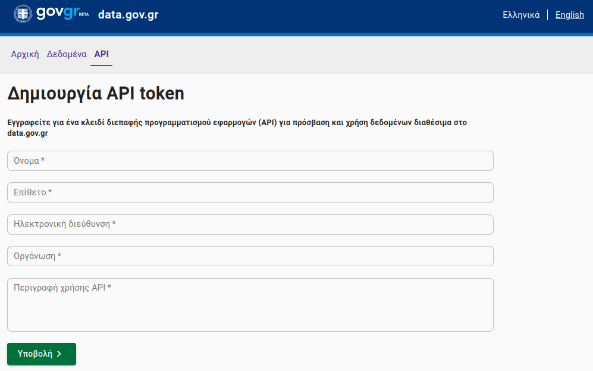

```{r}
#| label: set_directory
#| title: "Set working directory for the article"
#| include: false
library(here)
here::here("posts/tutorial-govgr-api")
```

## Introduction

In traditional data analysis, the analyst is usually tasked with "cleaning" the datasets
and bringing them into a suitable format for analysis. This approach implies that the data
already exists, consolidated in a single file. However, that is not always the case. The
problem with analysing a static dataset is that it does not account for any new values
that are recorded over time. In that scenario, we would need to retrieve the new data and
re-run the analysis using R or whatever tool we are working with. As one might expect,
this is unproductive, though when it only happens a few times a year it may not pose a
particular problem.

Where the inefficiency of this approach becomes apparent is when there is a continuous
stream of data, meaning the update cycle must be repeated on a daily basis. In these
cases, the value of an API becomes clear, as it provides us with the latest values with
relatively little effort. In addition, using an API makes it easier to incorporate new
data, so if we are building a predictive model its accuracy will remain at a reliable
level. Finally, APIs are also valuable in Shiny Apps or web applications more broadly,
allowing data analysis to be automated and ensuring that the information presented to
visitors remains up to date.

There are a great many APIs from which we can draw useful information. For more details
on the availability of free APIs, you can browse a relevant
[list of them](https://github.com/public-apis/public-apis). In this article we will focus
on the open data of Greece, made available through
[data.gov.gr](data.gov.gr).

## Requesting an API Key

The Greek API (like most APIs) requires us to register on the platform. We submit a
request on the corresponding page and fill in our details in **all** fields of the form,
as shown below:

{.white_bg
style="text-align:center; padding: 20px" width="500"}

After submitting, you should check your email, as a message will be sent containing a
Token that grants access to the API. Make sure to also check your Spam folder. It is
worth noting that if you lose the token or have deleted the message, you can submit a new
request, even using the same email address, and the system will send it to you again.

## Using the API

Once we have the Token, we need to use it to retrieve the data. On this particular
platform there are two ways to do so.

-   Using the API through the website
-   Using the API with R

The first approach (and arguably the less efficient one) is to request the data directly
from the data.gov.gr website. While this is straightforward, the downside is that we
download a fixed snapshot of the data, meaning that if we want to update it with the most
recent values we will need to download it again. Below, we walk through a real example of
using the API with R. It is worth noting that the platform itself implicitly encourages
this approach, as it provides examples in other popular programming languages (Python and
JavaScript).

## Example

Before wrapping up this article, we felt it was important to include a practical example.
At the time of writing, there are a total of 49 datasets available to choose from. To
highlight the benefits of using an API, we will select one that is updated fairly
frequently. One such dataset is the one tracking passengers who
[travel by ferry](https://www.data.gov.gr/datasets/sailing_traffic/).

```{r}
#| label: import_r_libs
#| title: "Import R libraries"
library(httr)
library(jsonlite)
```

First, we store the base URL of the dataset in a variable. For this particular dataset,
ferry passenger traffic, the URL is:

```{r}
#| label: api_base_url
#| title: "Set base API URL"
base = "https://data.gov.gr/api/v1/query/sailing_traffic"
```

Next, as the platform's documentation specifies, we need to define the date range we are
interested in. It is worth noting that you cannot retrieve a large date range with a
single API call. The ferry traffic data goes back to 2017 and is available up to the
present day (2023). For this example, we will request data for the first four days of
July 2023.

```{r}
#| label: api_call
#| title: "API call"
date_from = "2023-07-01"
date_to = "2023-07-04"

API_URL = paste0(base, "?date_from=", date_from, "&", "date_to=", date_to)

call = httr::GET(url = API_URL,
    add_headers(`Authorization` = paste0('Token token_id')
    )
)
```

Where **token_id** should be replaced with the token sent to you by data.gov.gr. After
making the GET request and waiting for the response, we receive a list containing various
pieces of information. We are interested in the data itself, which we can find under the
`content` field of the list. However, we notice that the values are not human-readable,
as they are returned in hexadecimal format.

```{r}
#| label: toReadableChars
#| title: "Convert data to readable format"
data = base::rawToChar(call$content)
```

With the command above we convert the raw bytes into readable characters. The next step
is to transform the result into a tabular format so that we can analyse it.

```{r}
#| label: tabularize_data
#| title: "Convert data to tabular format"
#data = jsonlite::fromJSON(data, flatten = TRUE)
```

Finally, using the `{jsonlite}` package, we obtain a data frame named `data` that
contains all destinations, passenger counts, and vehicle counts for each day we
requested.

## Acknowledgements {.appendix .unlisted}

Photo by <a href="https://pixabay.com/el/users/kuszapro-369349/?utm_source=link-attribution&utm_medium=referral&utm_campaign=image&utm_content=583537">Christopher Kuszajewski</a> from <a href="https://pixabay.com/el//?utm_source=link-attribution&utm_medium=referral&utm_campaign=image&utm_content=583537">Pixabay</a>